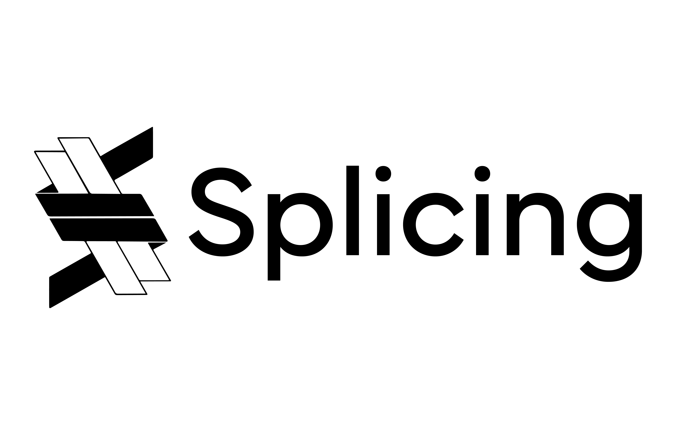
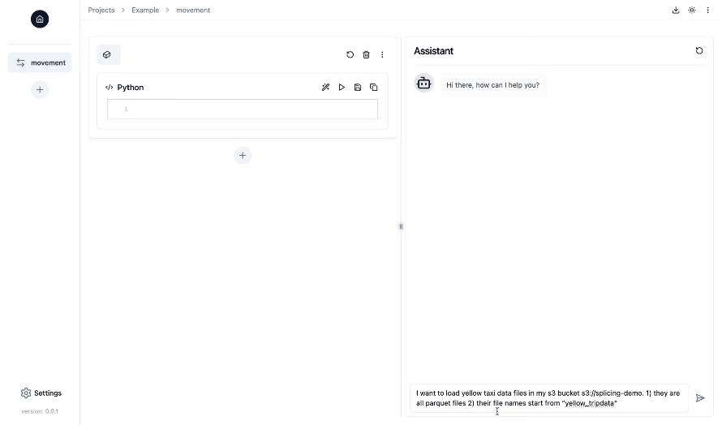

<div align="center">
  
</div>

<h2 align="center">Open-Source AI Copilot for Effortless Data Pipeline Building</h2>

<p align="center">
  <a href="https://github.com/splicing-ai/splicing">
    
  </a>
  <a href="https://github.com/splicing-ai/splicing/blob/main/LICENSE">
    
  </a>
  <a href="https://splicing-ai.github.io/splicing">
    
  </a>
  <a href="https://discord.gg/C7h5cqvjdb">
    
  </a>
</p>



## Key Features
- **Notebook-style interface with chat capabilities in a web UI**: Work on your data pipelines in a familiar Jupyter notebook interface, while the AI copilot assists and guides you by generating, executing, and debugging data engineering code throughout the process. 
- **No vendor lock-in**: Build your data pipelines with any data stack of your choice, and select the LLM you prefer for your copilot, with full flexibility.
- **Fully customizable**: Break down your pipeline into multiple components—such as data movement, transformation, and more—and tailor each component to your specific needs. Splicing then seamlessly assembles these components into a complete, functional data pipeline.
- **Secure and manageable**: Host Splicing on your own infrastructure, with full control over your data and LLMs. Your data and secret keys are never shared with LLM providers at any time.

## Quick Start
The easiest way to run Splicing is in Docker:

1. Install [Docker](https://docs.docker.com/engine/install/). 

2. Run the following command to run Splicing:
```bash
docker run -v $(pwd)/.splicing:/.splicing \
  -p 3000:3000 \
  -p 8000:8000 \
  -it --rm splicingai/splicing:latest
```
By default, all application data is stored in the `./.splicing` folder within the current directory where you run the above command. If you want to persist the data, make sure to back up this folder.

3. Navigate to http://localhost:3000/ to access the web UI.

You can also install Splicing without Docker for development by following the instructions in the [CONTRIBUTING](CONTRIBUTING.md#set-up-the-development-environment) guide.

## Roadmap
- **Data pipeline deployment**: Support deploying data pipelines to your production environments with a push-to-deploy experience.
- **More data pipeline components**: Support for more essential components in data pipelines, such as data quality checks and data lineage.
- **More integrations**: 
  + Support for a wide range of data integrations in data pipelines (e.g., various data sources and warehouses). 
  + Support more LLMs as copilots (e.g., Claude and local models). 
  + Streamline source code structure, making it easier for the community to add integrations.
- **Smarter copilot**: Enhance the copilot with more capabilities, such as automatically generating semantic models and ER diagrams for data in warehouses, making it easier to build data pipelines.

## Resources
- [Documentation](https://splicing-ai.github.io/splicing)
- [Demo](https://youtu.be/EaVopzAGszY)
- [Community](https://discord.gg/C7h5cqvjdb)

## Tech Stacks
- Frontend: [Next.js](https://nextjs.org/), [Tailwind CSS](https://tailwindcss.com/) and [Shadcn](https://ui.shadcn.com/)
- Backend: [FastAPI](https://fastapi.tiangolo.com/) and [Redis](https://redis.io/)
- Agentic framework: [LangGraph](https://langchain-ai.github.io/langgraph/)

## Contributing
Please refer to [CONTRIBUTING.md](CONTRIBUTING.md) for more details.

## FAQs

<details>
<summary><strong>What are the primary use cases for Splicing?</strong></summary>

Splicing assists in building data pipelines, including tasks like data ingestion, transformation, and orchestration, to prepare your data for downstream processes such as data analysis and machine learning.

</details>

<details>
<summary><strong>Who is Splicing for?</strong></summary>

Splicing is designed for data engineers, data scientists, and anyone who needs to build data pipelines. Even if you have limited data engineering experience, Splicing's AI Copilot will guide you step-by-step, and you can ask for help at any time using natural language.

</details>

<details>
<summary><strong>How is Splicing different from other code generation tools and AI copilots?</strong></summary>

Splicing is specifically designed for data engineering, a field with many complex choices that hasn't fully adopted generative AI for productivity. Unlike generic tools, Splicing focuses on optimizing language models for the fixed steps common in data pipelines. It's also deeply integrated with data sources and tools, allowing the copilot to understand your project's context—your configurations, data, and more—leading to more accurate and useful code generation compared to general-purpose copilots.

</details>

<details>
<summary><strong>How secure is Splicing? Will my data be shared?</strong></summary>

Splicing is open-source and can be hosted on your own infrastructure. Your data and secret keys are never shared with us or any LLM providers by design. Additionally, the Splicing Copilot doesn't automatically execute generated code—you control when and how it's run.

</details>

<details>
<summary><strong>Can I run data pipelines built with Splicing elsewhere?</strong></summary>

Yes! Splicing generates code using your preferred data integrations and tools. You can export the code with a single click and run or deploy it anywhere you like. There's no vendor lock-in.

</details>
