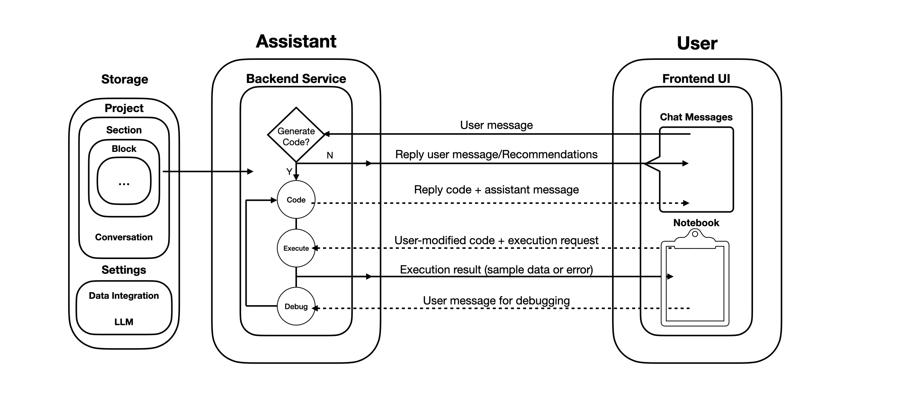

# Architecture

This is a high-level overview of Splicing's architecture. The "User" interacts with the "Assistant" through either a chat interface or a notebook interface. The "Assistant" is responsible for understanding user intent, answering questions, and invoking the appropriate tool to generate or debug code as needed. Code execution takes place on the backend.

The underlying agent is built using [LangGraph](https://langchain-ai.github.io/langgraph/), supporting multi-turn conversations with access to code generation tools. In the future, we plan to integrate more tools to further enhance capabilities of the "Assistant".
