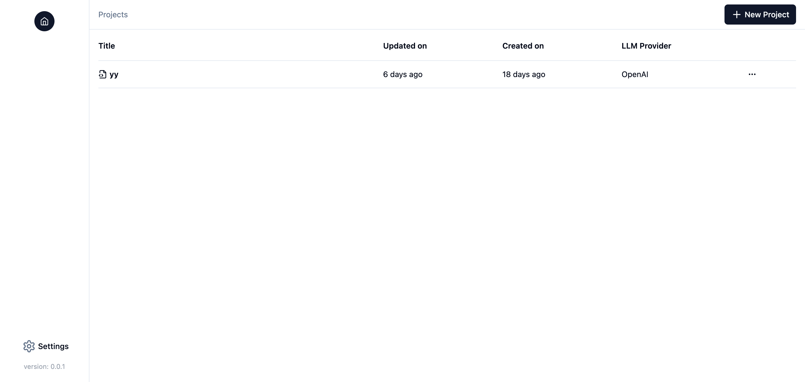

# Getting Started

## Installation
The easiest way to run Splicing is in [Docker](https://docs.docker.com/engine/install/). After installing Docker, you can run Splicing by executing the following command:
```bash
docker run -v $(pwd)/.splicing:/app/.splicing \
  -p 3000:3000 \
  -p 8000:8000 \
  -it --rm splicingai/splicing:latest
```

To install Splicing without Docker for development, please refer to the [CONTRIBUTING](https://github.com/splicing-ai/splicing/blob/main/CONTRIBUTING.md) guide.

## Setup
After running the command above, navigate to [http://localhost:3000/](http://localhost:3000/) to access the web UI of Splicing. You should see the following screen as the "Home" page:



By default, all application data is stored in the `./.splicing` folder within the current directory where you run the above command. If you want to persist the data, make sure to back up this folder.

## Usage
For how to use Splicing, please refer to the [How-to Guides](how-tos/integration-llm.md).
