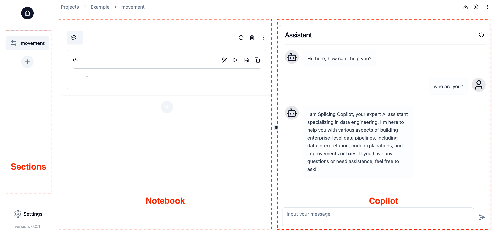

# Creating a Project
A **Project** represents a data pipeline in Splicing. You can create a project by clicking the "New Project" button in the right top corner on "Home" page. An LLM is required to create a project, so you must [add an LLM](./integration-llm.md#llms) before creating a project.

After creating a project, you can click the project name to navigate to the "Project" page.

The "Project" page consists of three parts:

- **Sections**: Different components of the data pipeline. For more details, please refer to the [Building Data Pipeline with Sections](sections.md) guide.
- **Notebook**: A notebook-style workspace for writing and running code. For more details, please refer to the [Writing and Running Code in Notebook-style Workspace](notebook.md) guide.
- **Copilot**: A chat interface for interacting with Splicing copilot. For more details, please refer to the [Getting Assistance from Copilot](copilot.md) guide.

Last but not least, you can click the "Settings" button in the left bottom corner to edit data integrations and LLMs at any time.
