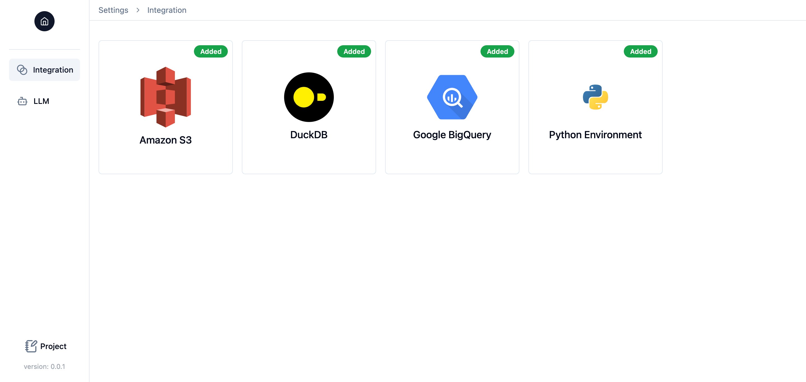

# Adding Data Integrations and LLMs
By clicking "Settings" at the bottom of the left sidebar, you can navigate to the "Settings" page to add data integrations and LLMs for your projects. You can add or edit them at any time while working on a project.

## Data Integrations
You can add various data integrations into your data pipelines. For instance, you can configure BigQuery as the data warehouse in your pipeline. All keys and secrets are securely stored in the `./.splicing/credentials.yml` file and are never exposed to LLMs.

The latest version of Splicing supports the following data integrations:

  - Amazon S3
  - DuckDB
  - Google BigQuery
  - Local Python Environment (data will be saved as a pandas DataFrame in the backend database)

## LLMs
You can add various LLMs to empower your copilot in building data pipelines. For example, you can add OpenAI GPT-4 as the LLM for your project. Please note that an LLM is **required** to create a project, so you must add at least one LLM before starting a new project.

The latest version of Splicing supports the following LLM providers:

  - OpenAI
