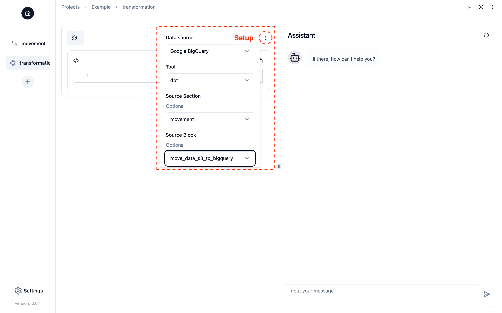
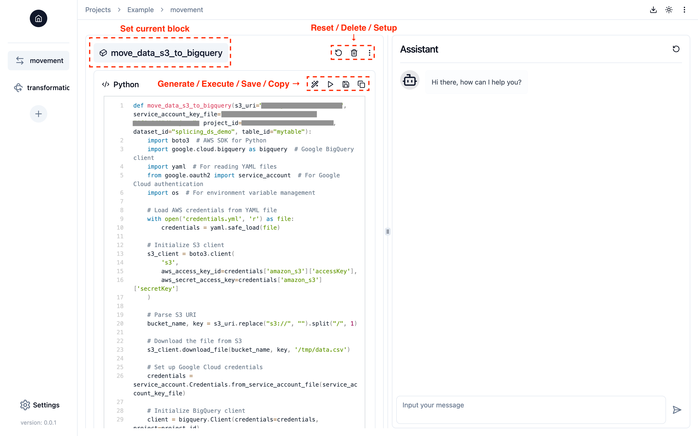
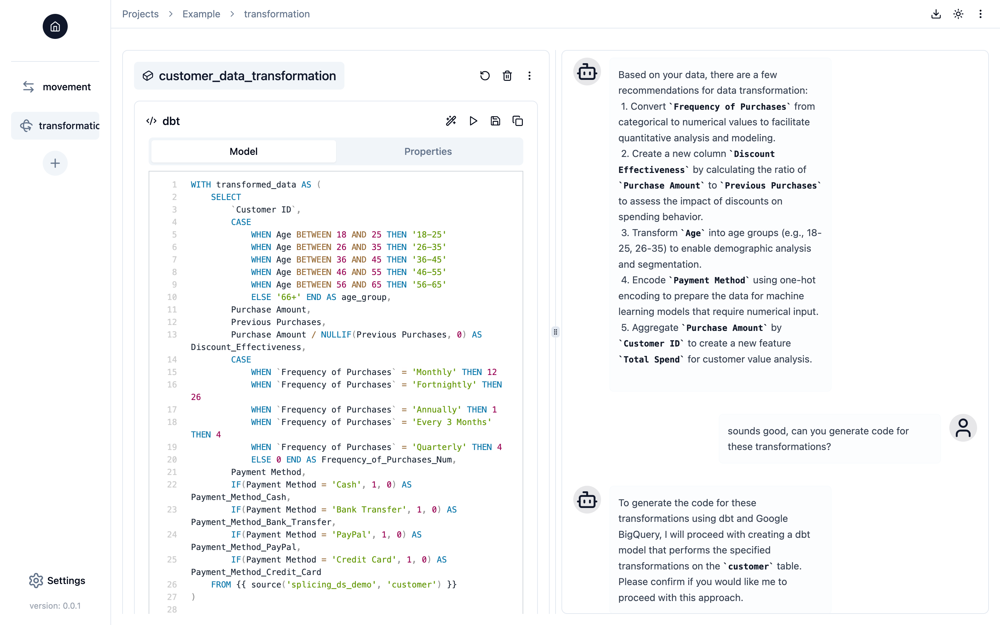

# Writing and Running Code in Notebook-style Workspace

You can work on your data pipeline just as you would write and run code in a Jupyter notebook. In Splicing, a **Block** functions like a cell in Jupyter notebook—it is a unit of code that you can create and execute. You can simply create a new block by clicking the "+" button in the "Notebook" part of the "Project" page.

## Setting Up a Block
The first step in any data engineering task is identifying where your data is located and selecting the appropriate tools for processing it. Before writing any code, please provide the necessary information by clicking **the button with three vertical dots in the top-right corner** of a block:



You can modify the block's setup at any time while working on it. 

### Linking a Source Block in Setup
In the block setup, you can link a block from the current or other sections to the current block by configuring the *optional* "Source Section" and "Source Block" options. This indicates that the current block is built based on the output data from the source block, providing Splicing Copilot with the full context of your source block. For example, if you load data into specific tables in a data warehouse in the source block, Splicing Copilot will recognize where the data is stored and automatically use it in the current block. By linking blocks, you can create a seamless data pipeline without needing to manually track or specify data details.

## Generating Code in a Block
Splicing currently supports two popular programming languages for data engineering: **Python** and **SQL with [dbt](https://www.getdbt.com/)**. By simply clicking the "Generate" button (or [request code generation through the conversation](copilot.md#code-generation)), Splicing will automatically generate the code needed to perform the requested data engineering tasks, based on the current block's configuration and your conversation with Splicing Copilot. Currently, generated code will *overwrite* any existing code in the block.



### Generating Python Code
Unlike writing Python code in a Jupyter notebook cell, Splicing generates data engineering code within a block as a **Python function**. The Python function will follow the structure below (you should write your code in the same format):

```python
def <function-name>(<function-kwargs>):
    <import-statement>
    <data-engineering-code>
```

where:

  - `<function-name>` will be the block name, representing the data engineering task the function performs.
  - `<function-kwargs>` will include key configurations for the data engineering task, typically defined in the block setup or provided through the conversation with Splicing Copilot.
  - `<import-statement>` will include the necessary import statements for third-party libraries required for the task.
  - `<data-engineering-code>` will be the main code performing the task.
    - Additionally, you can read secret keys from the `credentials.yaml` file.
    - If the destination of your data movement task, or the location of your cleaning and transformation tasks, is the *local Python environment*, you should return a pandas DataFrame so Splicing can save it:
    ```python
    def <function-name>(<function-kwargs>):
      ... # import statements
      ... # main data engineering code generating a pandas DataFrame `df`
      return df
    ```
    - If the source of your data movement task, or if your current block is linked to a source block where data is output to the *local Python environment*, you should include `df=None` as a keyword argument with `None` as the default value in `<function-kwargs>`:
    ```python
    def <function-name>(df=None, ...):  # more keyword arguments
      ... # import statements
      ... # main data engineering code taking a pandas DataFrame `df` from the source block
    ```
  
[The image above](#generating-code-in-a-block) provides a concrete example of loading a CSV file from Amazon S3 to Google BigQuery. These conventions are designed to componentize data engineering tasks, enabling Splicing to easily build and assemble functional data pipelines. They also represent good practices in data engineering, promoting code readability and maintainability.

### Generating SQL (dbt) Code
Currently, dbt is only supported in the data transformation section. Each code block will represent a dbt model, consisting of SQL code ([Model](https://docs.getdbt.com/docs/build/sql-models)) and YAML configuration ([Properties](https://docs.getdbt.com/reference/configs-and-properties)), where:

  - The model name will be the block name, representing the data transformation task the model performs.
  - The properties file will include AI-generated descriptions of the source table, the model table, and their columns.



## Modifying and Saving Code in a Block
The generated code may not always be perfect, so you can modify it to fix errors or adjust it to meet your needs if you prefer not to ask Splicing Copilot for changes. You can directly edit the code in the block and click the "Save" button to apply your changes. Keep in mind that if you change the function name in your Python code or the model name in your dbt model, the block name will be updated accordingly.

## Running Code in a Block
You can run the code in a block by clicking the "Run" button at any time. After running the code, you may see three types of outputs:

  - **Data Preview**: Data is a first-class citizen in Splicing. If your code executes successfully, Splicing Copilot will automatically read the data from the destination and display a sample of the data in the "Data Preview" tab (even with multiple destinations). However, note that this is based on Splicing Copilot's best effort, so the data might not be displayed if Splicing Copilot fails to read it from the destination.  
  - **Return Value**: (Python only) The return value of your Python function, displayed if Splicing Copilot fails to read the data from the destination, even though your function executed successfully.
  - **Error**: The error message and stack trace from the failed code execution. You can ask Splicing Copilot to help debug the error.

## Setting Current Block
Similar to a Jupyter Notebook, a section can contain multiple blocks. To help Copilot better understand the context of the requested data engineering task and generate code within a block, you can set or unset a block as the current block by [clicking its name toggle](#generating-code-in-a-block) if there are multiple blocks in a section. When you click the "Generate", "Run", or "Save" button for a block, it will automatically be set as the current block.

## Downloading Code for Building Data Pipeline
You can download all the code written by you and Splicing Copilot in the project by clicking the "Download" button in the top-right corner of the "Project" page. The code will be packaged as a zip file with the following directory structure:

```
<project-name>/
├── <section-name>/ (dbt project directory)
├── <section-name>.py (Python script containing functions defined in the blocks of a section)
├── ...
├── dbt_profiles/
│   └── profile.yml (dbt profile)
├── credentials.yml (all secret keys required for the project)
└── requirements.txt (all third-party Python libraries required for the project)
```
