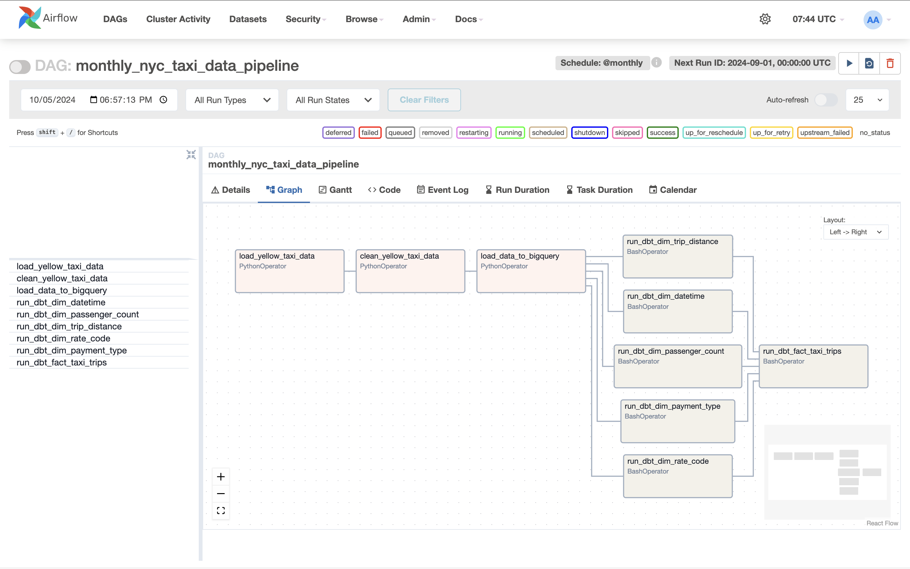

# Assembling Sections and Orchestrating Data Pipeline
There should be only one orchestration section, and it must be the last section in the project, which assembles all previous sections and blocks into a complete and functional data pipeline.

## Using Airflow
Currently, Splicing supports using [Apache Airflow](https://airflow.apache.org/) to orchestrate data pipelines. By default, Splicing will generate an [Airflow DAG](https://airflow.apache.org/docs/apache-airflow/stable/concepts/dags.html) in a block:

  - The DAG name will be the block name, representing the data transformation task the model performs.
  - Every block is defined as a task in the DAG.
  - The dependencies between tasks will be defined if "Source Section" and "Source Block" are set in a block.
  - By default,

    - A block written in Python will be defined as a [PythonOperator](https://airflow.apache.org/docs/apache-airflow/stable/howto/operator/python.html). 
    - A block written in SQL (dbt) will be defined as a [BashOperator](https://airflow.apache.org/docs/apache-airflow/stable/howto/operator/bash.html), which runs `dbt run` command to run a dbt model.
    
    You can customize the task type (different operators) and the definition of the task (arguments to the operator) as your needs.

### Exporting Data Pipeline to Airflow
You can [download the code in the project](notebook.md#downloading-code-for-building-data-pipeline) and export it as an Airflow DAG by following these steps:

  - Install the project dependencies by running `pip install -r requirements.txt` in the Python environment where Airflow is running.
  - Uncompress the downloaded zip file and place it in the `dags` folder of your Airflow home directory (i.e., `AIRFLOW_HOME/<dags_folder>`, usually `~/airflow/dags`), or upload it to a managed Apache Airflow service (e.g., [MWAA](https://aws.amazon.com/managed-workflows-for-apache-airflow/) or [Astronomer](https://www.astronomer.io/)).
  - You should now be able to see the DAG in the Airflow UI and trigger a DAG run to execute the data pipeline.

