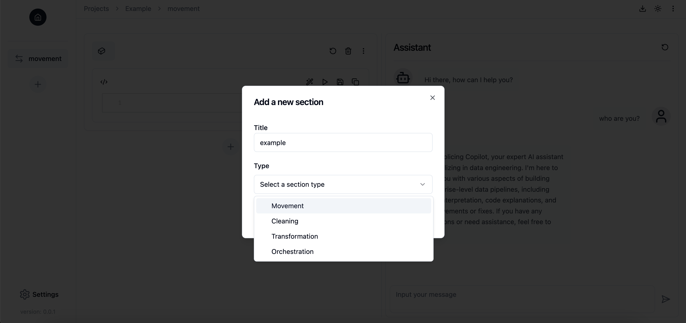

# Building Data Pipeline with Sections
Splicing componentizes the data pipeline into **Sections**, each serving a specific purpose, and then seamlessly assembles these components into a complete, functional data pipeline. Currently, Splicing supports the following types of sections:

- **Movement**: Move data from one source to another. For example, you can load CSV files from your S3 bucket to Google BigQuery for further transformation.
- **Cleaning**: Clean data to ensure it meets basic quality requirements before being used in downstream tasks. For example, this often includes processes like handling missing values, correcting data types, and removing duplicates to ensure consistency.
- **Transformation**: Transform data to meet the specific requirements of downstream tasks, such as data modeling and machine learning. This might involve aggregating data, creating new features, or converting formats.
- **Orchestration**: Orchestrate the components across different systems and processes within a data pipeline to ensure tasks are executed in the correct sequence and at the appropriate time. For more details, refer to the [Assembling Sections and Orchestrating Data Pipeline](orchestration.md) guide.

## Creating a Section
You can add a section by clicking the "+" button in the "Sections" part.

## Working on a Section
Refer to the [Writing and Running Code in Notebook-style Workspace](notebook.md) guide to understand how to work on a section.
