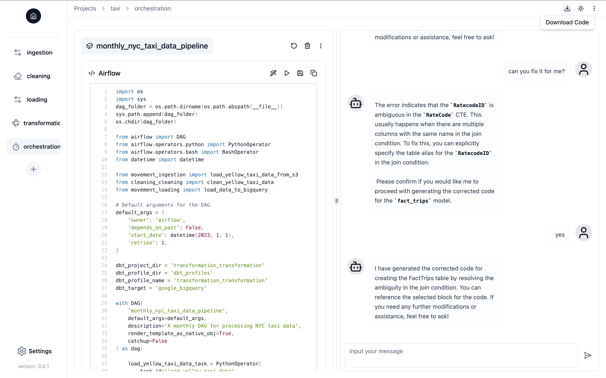

# Introduction

Splicing is an open-source AI copilot for effortless data pipeline building. It offers the following key features:

- **Notebook-style interface with chat capabilities in a web UI**: Work on your data pipelines in a familiar Jupyter notebook interface, while the AI copilot assists and guides you by generating, executing, and debugging data engineering code throughout the process. 
- **No vendor lock-in**: Build your data pipelines with any data stack of your choice, and select the LLM you prefer for your copilot, with full flexibility.
- **Fully customizable**: Break down your pipeline into multiple components—such as data movement, transformation, and more—and tailor each component to your specific needs. Splicing then seamlessly assembles these components into a complete, functional data pipeline.
- **Secure and manageable**: Host Splicing on your own infrastructure, with full control over your data and LLMs. Your data and secret keys are never shared with LLM providers at any time.

## Feature Highlights
### Generate Code with Conversations
Interact with Splicing Copilot to generate code seamlessly through natural language conversations.

<video width="100%" controls>
  <source src="assets/videos/conversation-generate.mp4" type="video/mp4">
  Your browser does not support the video tag.
</video>

### Edit and Execute Code
Modify your code within an interactive environment, similar to Jupyter notebooks, and execute it directly.

<video width="100%" controls>
  <source src="assets/videos/edit-execute.mp4" type="video/mp4">
  Your browser does not support the video tag.
</video>

### Debug Code
Request Splicing Copilot to debug your code and help identify and fix issues efficiently.

<video width="100%" controls>
  <source src="assets/videos/debug.mp4" type="video/mp4">
  Your browser does not support the video tag.
</video>

### Connect Pipeline Components and Recommend Data Engineering Techniques
When building a data pipeline, each component operates on the context and data from the previous one. Splicing Copilot understands this flow and recommends optimal data engineering techniques based on your pipeline's context.

<video width="100%" controls>
  <source src="assets/videos/link-recommend.mp4" type="video/mp4">
  Your browser does not support the video tag.
</video>

### Export Code Ready for Deployment
Download code for your data pipeline in a single click, optimized and ready for deployment.

#### Download Code

#### Code Structure

#### Ready for Deployment

